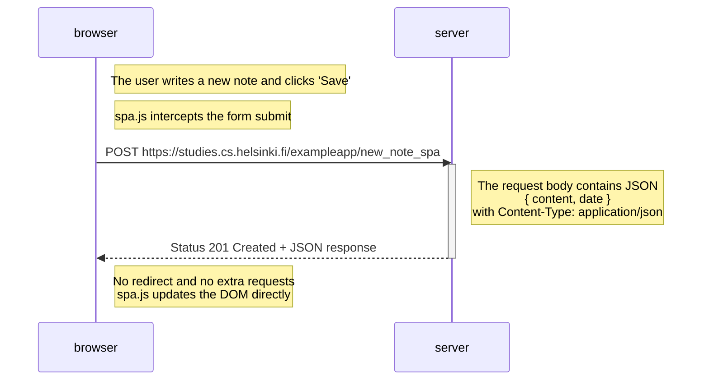

```mermaid
    sequenceDiagram
    participant browser
    participant server

    Note right of browser: The user writes a new note and clicks 'Save'

    Note right of browser: spa.js intercepts the form submit

    browser->>server: POST https://studies.cs.helsinki.fi/exampleapp/new_note_spa
    activate server
    Note right of server: The request body contains JSON<br>{ content, date }<br>with Content-Type: application/json
    server-->>browser: Status 201 Created + JSON response
    deactivate server

    Note right of browser: No redirect and no extra requests<br>spa.js updates the DOM directly

```
